<h1 align="center">Hi, I'm Fasai Utawan 👋</h1>

  Data Science & Software Innovation Student 
  Building AI and data products that can run reliably in production.

---

## About Me

I'm a final-year Data Science student who enjoys working across the full stack —
from training ML models to shipping them in containers on Kubernetes.

Currently deepening my skills in DevOps and cloud-native infrastructure.
I care about systems that are observable, reproducible, and easy to deploy.

- 🔧 Recently: Completed DevOps internship at Artery Partner — CI/CD, Kubernetes & cloud infrastructure
- 🤖 Building: AI-powered analytics platforms and computer vision systems
- 📦 Into: MLOps, infrastructure automation, and distributed systems
- 🎯 Open to: DevOps / MLOps / Data Engineering roles
- 🌐 Portfolio: [skyshineth.github.io](https://skyshineth.github.io/)
- 📄 CV: [View Full CV](https://skyshineth.github.io/cv/)
- 📫 Email: [fasai.utawan@gmail.com](mailto:fasai.utawan@gmail.com)

---

## 🛠️ Technical Skills

#### Core stack (most used recently)

#### DevOps & infrastructure (also)

#### Programming languages (also)

#### AI & machine learning (also)

#### Web & mobile (also)

#### Databases (also)

#### Cloud & tools (also)

---

## GitHub Stats

  
  

Cards are generated in-repo and refreshed daily via GitHub Actions.

---

## Connect with Me

  
  
  
  

